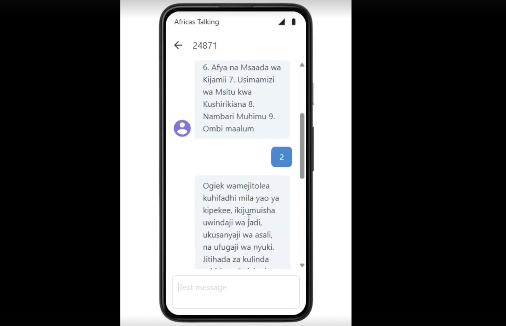
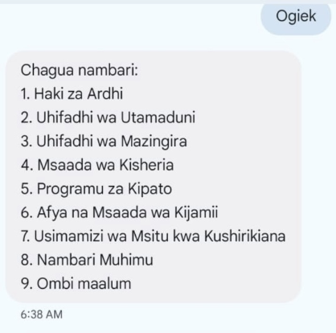

# Muhtasari wa Mradi

Mradi huu, ulifadhiliwa na Mozilla Technology Fund, na unaongozwa na Lusike Mukhongo, Chad Edwards, Autumn Edwards, na Cynthia Klekar-Cunningham,kwa msaada wa Cody Thornell na Khang Nguyen. Lengo la mradi ni kutengeneza mfano wa mfumo wa ujumbe wa SMS unaoendeshwa na teknolojia ya AI kwa ajili ya jamii ya WaOgiek wanaoishi katika Msitu wa Mau. Kupitia mfumo huu, wanajamii wataweza kutuma ujumbe mfupi wa maandishi kwa nambari maalum na kupokea majibu kutoka kwa chatbot kuhusu historia ya WaOgiek, uhifadhi wa misitu, maamuzi ya kisheria, na mengineyo. Mradi huu umechagua kutumia simu za kawaida, pia zinajulikana kama kabambe, kwa sababu hazihitaji intaneti, zina betri zinazodumu kwa muda mrefu, na ni nafuu – hivyo kuziwezesha kuwa rahisi kupatikana na jamii zilizo na rasilimali chache.

Lengo kuu la mradi huu lilikuwa kubaini jinsi mfumo wa ujumbe wa maandishi ulioboreshwa kwa teknolojia ya AI pamoja na tovuti vinaweza kusaidia kwa ufanisi watu wa jamii ya WaOgiek katika juhudi zao za kutetea usalama wa chakula, haki za ardhi, na utunzaji wa Msitu wa Mau kupitia kubadilishana taarifa, kuratibu matukio ya kijamii, na kuhifadhi maarifa ya asili ya WaOgiek.

Tulipata maarifa ya data kutoka kwa mahojiano, Majadiliano ya Vikundi Tarajiwa (FGDs), uchunguzi wa kietnografia wa juhudi za upandaji miti upya katika Msitu wa Mau, na warsha ya pamoja ya ubunifu na majaribio ya matumizi.

Ili kukamilisha mfumo wa SMS, tulishirikiana kuunda tovuti (sautiyaogiek.com) kama jukwaa la kidijitali linalobadilika kwa ajili ya kuhifadhi na kushiriki hadithi, sauti, na historia za mdomo za jamii ya WaOgiek. Tovuti hii ni hazina hai ambapo maarifa ya jamii yanaweza kurekodiwa, kufikiwa, na kusherehekewa. Kwa kutoa kitovu kimoja cha taarifa za kihistoria, maonyesho ya kitamaduni, rasilimali za kisheria, na juhudi za kimazingira, tovuti hii inakuza ujifunzaji kati ya vizazi na kuimarisha kumbukumbu ya pamoja ya jamii. Pia inaongeza mwonekano wa uzoefu na mchango wa WaOgiek, na kuiwezesha jamii kuunda simulizi lao wenyewe na kuhakikisha kuwa mifumo yao ya maarifa inabaki kupatikana na kuwa na umuhimu katika harakati za utetezi wa ndani na wa kimataifa.

# Introduction

This project was funded by Mozilla Technology Fund under Lusike Mukhongo, Chad Edwards, Autumn Edwards, Cynthia Klekar-Cunningham and assisted by Cody Thornell and Khang Nguyen with the goal of creating a prototype for an AI-enhanced SMS system for the Ogiek community in Mau forest to send SMS messages to a number and get a chatbot response about their history, forest conservation, legal rulings and more. The project selected feature phones for developing an AI-enhanced messaging system because they can be used without internet access, their batteries last longer, and the phones are affordable, thereby making them more accessible to communities.

The primary objective was to determine how an AI-enhanced messaging system could effectively support the Ogiek people in their efforts to advocate for food security,  land rights, and Mau forest stewardship through the exchange of information, coordination of community events, and the documentation of Ogiek Indigenous knowledge.

We generated data insights from interviews, Focus Group Discussions (FGDs), ethnographic observations of reforestation efforts in Mau Forest, and a co-design and usability workshop.

To complement the SMS system, we co-developed a website (sautiyaogiek.com) as a dynamic digital space for preserving and sharing Ogiek stories, voices, and oral histories. The platform serves as a living repository where community knowledge can be recorded, accessed, and celebrated. By providing a central hub for historical accounts, cultural expressions, legal resources, and environmental initiatives, the website fosters intergenerational learning and enhances collective memory. It also enables broader visibility of the Ogiek’s experiences and contributions, allowing the community to shape their narrative and ensure that their knowledge systems remain accessible and relevant in both local and global advocacy.


## Get Started

### General
- Clone the repository
- In terminal run:
```bash
pip install -r requirements.txt
```

### Test SMS
1. Follow the steps under General
2. Generate Africa Talking api key, phone number shortcode, language id (0 for english, 1 for swahili) and place into a .env file with SAND_ and LANG values for testing. (AT_ values are used for production).
```
AT_USERNAME=xxxxxxx
AT_API=xxxxxxxxxxxxxxxxxxxx
AT_SEND_ID=xxxxx
SAND_USERNAME=xxxxxxx
SAND_API=xxxxxxxxxxxxxxxxxxxx
SAND_SEND_ID=xxxxx
LANG_ID=x
```
3. Launch simulator at https://developers.africastalking.com/simulator and use an available number such as `+254722123123`
4. Run server in sandbox mode and message short code
```
python app.py --sandbox
```
*Note that Africa Talking's Simulator currently doesn't support newline characters, but they will work in production.*



### Test RAG
1. Install ollama at https://ollama.com/download
1. Install model, currently using mannix/llamax3-8b-alpaca:latest model:
```
ollama pull mannix/llamax3-8b-alpaca:latest
```
2. Make a folder name 'data' within the root folder.
3. Place all `.docx` files you want the model to fetch information from into `/data` folder
4. In terminal run (Re-run this every time you add new files):
```
python update_database.py
```
4. In terminal run and insert your chat to the model here
```
python query_data [insert_chat_here]
```
5. Or through sms connection, choose number 9 on sms menu for generative response

### Production Deployment
1. Verify you have completed the above steps to test on Simulator in sandbox mode and RAG module is working
2. Make sure `AT_` and `LANG_ID` values are set in .env like below
```
AT_USERNAME=xxxxxxx
AT_API=xxxxxxxxxxxxxxxxxxxx
AT_SEND_ID=xxxxx
SAND_USERNAME=xxxxxxx
SAND_API=xxxxxxxxxxxxxxxxxxxx
SAND_SEND_ID=xxxxx
LANG_ID=x
```
3. Launch `app.py` in production mode
```
python app.py --prod
```
4. Send a message or shortcode to AT_SEND_ID value from a device on the African SMS network with `guide/AIKENYASMS User Guide.pdf`



### App.py Args
- Sandbox mode with `-s` or `--sandbox`
- Production mode with `-p` or `--prod`
